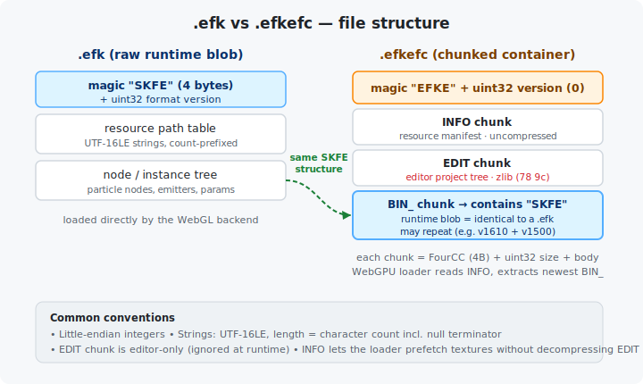
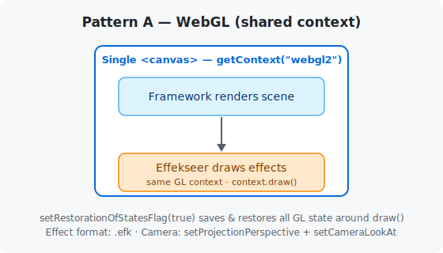
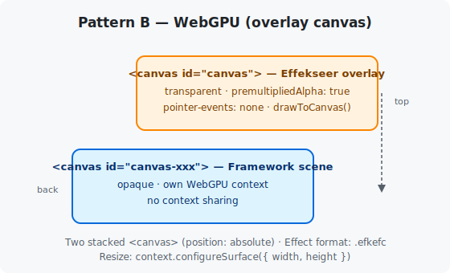
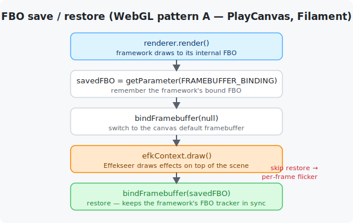
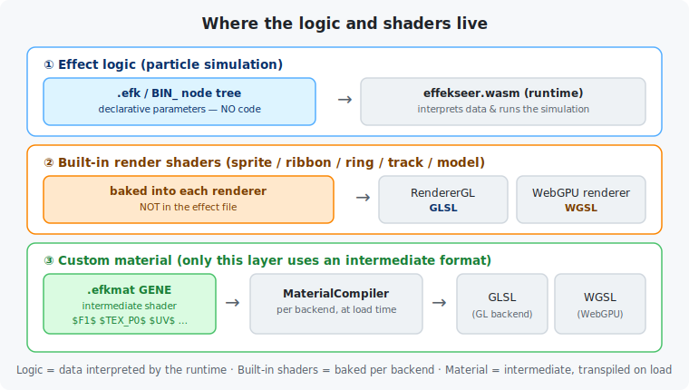
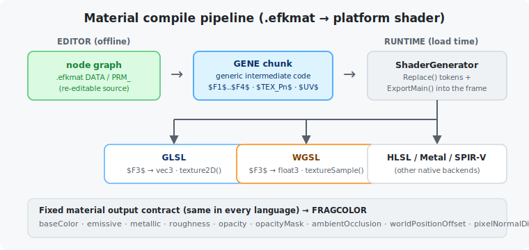

# Effekseer for Web — Integration Guide

This document describes the technical structure of each sample and the integration patterns used to combine Effekseer with various rendering frameworks.

---

## Table of Contents

1. [Sample Structure](#1-sample-structure)
2. [Effect Resources](#2-effect-resources)
3. [Integration Patterns Overview](#3-integration-patterns-overview)
4. [Per-Framework Details](#4-per-framework-details)
   - [WebGL](#41-webgl)
   - [WebGPU](#42-webgpu)
   - [three.js (WebGL)](#43-threejs-webgl)
   - [three.js (WebGPU)](#44-threejs-webgpu)
   - [Babylon.js (WebGL)](#45-babylonjs-webgl)
   - [Babylon.js (WebGPU)](#46-babylonjs-webgpu)
   - [PlayCanvas (WebGL)](#47-playcanvas-webgl)
   - [PlayCanvas (WebGPU)](#48-playcanvas-webgpu)
   - [Filament (WebGL)](#49-filament-webgl-)
   - [Rhodonite (WebGL)](#410-rhodonite-webgl)
   - [Rhodonite (WebGPU)](#411-rhodonite-webgpu)
5. [Key Technical Considerations](#5-key-technical-considerations)
6. [Where the Logic and Shaders Live](#6-where-the-logic-and-shaders-live)
   - [Layer 1 — Effect logic](#61-layer-1--effect-logic-data-not-code)
   - [Layer 2 — Built-in render shaders](#62-layer-2--built-in-render-shaders)
   - [Layer 3 — Custom materials](#63-layer-3--custom-materials-the-intermediate-format)
   - [How the shader is assembled (pseudocode)](#64-how-the-shader-is-assembled-pseudocode)
   - [GLSL vs WGSL emission differences](#65-glsl-vs-wgsl-emission-differences)

---

## 1. Sample Structure

Every sample follows the same three-file layout:

```
examples/<framework>/<effect>/
├── index.html   # Script tags (framework + Effekseer), canvas element(s), status div
├── index.js     # Scene setup, Effekseer initialization, GUI, render loop
└── style.css    # Full-screen canvas layout
```

`index.js` is always a **native ES module** (`<script type="module">`).  
The GUI uses [lil-gui](https://lil-gui.georgealways.com/) imported directly from a CDN.

### Scene contents (common to all samples)

| Element | Description |
|---------|-------------|
| Grid | 30-division, 15-unit floor grid on the XZ plane |
| Cube | 2×2×2 rotating blue cube centred at (0, 1, 0) |
| Camera | Orbit camera — mouse drag rotates, scroll wheel zooms |
| GUI | Position / Rotation sliders + "▶ Play Effect" button |

---

## 2. Effect Resources

All effect files are under `examples/effekseer/Resources/`.

| Effect | `.efk` (WebGL legacy) | `.efkefc` (WebGPU compiled) |
|--------|-----------------------|-----------------------------|
| Laser01 | `Laser01.efk` | `00_Basic/Laser01.efkefc` |
| Laser02 | `Laser02.efk` | `00_Basic/Laser02.efkefc` |
| Simple_Ring_Shape1 | `Simple_Ring_Shape1.efk` | `00_Basic/Simple_Ring_Shape1.efkefc` |
| block | `block.efk` | — (no compiled version; all backends use `block.efk`) |

### Format differences

| Format | Extension | Notes |
|--------|-----------|-------|
| `.efk` | Legacy binary | Supported by WebGL backend |
| `.efkefc` | Compiled binary | Supported by WebGPU backend; smaller, faster load |

### Format internals

The two formats are not unrelated: **a `.efkefc` is a container that embeds a `.efk`-equivalent
runtime blob**. The values below were read directly from the sample files in
`examples/effekseer/Resources/`.



Conventions shared by both formats:

- **Endianness**: all integers are little-endian `uint32`.
- **Strings**: UTF-16LE, prefixed by a `uint32` **character** count that *includes* the null
  terminator (e.g. `Texture/LaserMain01.png` → length `0x18` = 24).

#### `.efk` — raw runtime blob

```
┌────────────┬───────────────────────────────────────────────┐
│ "SKFE"     │ 4-byte magic                                  │
│ uint32     │ format version                                │
│ …          │ resource path table (textures / models / …)   │
│ …          │ node / instance tree (emitters, particles)    │
└────────────┴───────────────────────────────────────────────┘
```

The standalone `.efk` files in this repo report **format version 1** (`Laser01`, `Laser02`,
`Simple_Ring_Shape1`) or **13** (`block`) — these are legacy exports. The same logical data,
re-exported into a `.efkefc`, carries a much newer runtime version (see below).

#### `.efkefc` — chunked container

```
"EFKE"  uint32 version(0)
  ├─ "INFO"  uint32 size │ resource manifest (uncompressed)
  ├─ "EDIT"  uint32 size │ editor project tree  (zlib, starts 0x78 0x9C)
  └─ "BIN_"  uint32 size │ runtime blob — itself an "SKFE" stream
```

- Each chunk is a **FourCC tag (4 bytes) + `uint32` size + body**, laid out back to back.
- **`INFO`** starts with the runtime version (`1500` = Effekseer 1.50 in the basic samples) followed by
  six resource path lists — *color / normal / distortion textures, models, sounds, materials*.
  This lets a loader discover and prefetch dependencies without inflating the `EDIT` chunk.
  Example (`00_Basic/Laser01.efkefc`): 3 color textures, everything else empty.
- **`EDIT`** is the editable source tree, **zlib-compressed** — present so the file can be
  re-opened in the Effekseer editor. It is ignored at runtime.
- **`BIN_`** is the compiled runtime stream and is byte-for-byte an `SKFE` blob, i.e. the same
  thing a `.efk` contains. A file may carry **multiple `BIN_` chunks** for backward
  compatibility — `00_Version16/Aura01.efkefc` ships two (runtime versions **1610** = 1.61 and
  **1500** = 1.50); the loader picks the newest version it understands.

> **Practical implication.** The WebGL path loads `.efk` directly; the WebGPU path loads
> `.efkefc`, where the loader reads `INFO` for resources and decodes the appropriate `BIN_`.
> Because `BIN_` ≡ `.efk`, the *particle simulation data is identical* across backends — the
> only real differences are the container wrapper and the embedded runtime version.

---

## 3. Integration Patterns Overview

Two distinct integration patterns appear across all frameworks, determined by whether the backend is WebGL or WebGPU.

### Pattern A — WebGL (shared context)



- **Canvas**: one `<canvas>` element shared by the framework and Effekseer
- **Context**: `canvas.getContext("webgl2")` — Effekseer receives the same GL object the framework uses
- **Effekseer init**: `effekseer.initRuntime(wasmPath, successCb, errorCb)` (callback-based)
- **Draw call**: `context.update(1)` → `context.draw()`
- **State protection**: `context.setRestorationOfStatesFlag(true)` saves and restores all GL state around `draw()`

### Pattern B — WebGPU (overlay canvas)



- **Canvas**: two `<canvas>` elements stacked with `position: absolute`; the Effekseer canvas sits on top with `pointer-events: none`
- **Context**: each canvas has its own WebGPU context; no sharing
- **Effekseer init**: `await initRuntime({backend:"webgpu", ...})` → `await createContext({..., enablePremultipliedAlpha:true})`
- **Draw call**: `context.update(1)` → `context.drawToCanvas()`
- **Resize**: Effekseer canvas must be resized explicitly; `context.configureSurface({width, height})` notifies Effekseer

### Camera synchronization

Both patterns require passing the host renderer's camera state to Effekseer each frame.

**Option 1 — perspective + lookAt (most frameworks)**
```javascript
context.setProjectionPerspective(fovDeg, aspect, near, far);
context.setCameraLookAt(ex, ey, ez, cx, cy, cz, 0, 1, 0);
```

**Option 2 — raw matrices (three.js only)**
```javascript
context.setProjectionMatrix(Array.from(camera.projectionMatrix.elements));
context.setCameraMatrix(Array.from(camera.matrixWorldInverse.elements));
```

---

## 4. Per-Framework Details

### 4.1 WebGL

| Item | Detail |
|------|--------|
| Pattern | A (shared context) |
| Context acquisition | `canvas.getContext("webgl2")` |
| Effekseer init | Callback: `effekseer.initRuntime(wasmPath, cb, errCb)` |
| Effect format | `.efk` |
| Camera | Manual spherical coordinates; `setProjectionPerspective` + `setCameraLookAt` |
| Render hook | `requestAnimationFrame` loop; `draw()` after scene render |
| FBO handling | None required (renders to default framebuffer throughout) |

```javascript
effekseer.initRuntime("../../effekseer/effekseer-webgl.wasm", () => {
  const context = effekseer.createContext();
  context.init(gl);
  context.setRestorationOfStatesFlag(true);
  // load effect, start loop...
});
```

---

### 4.2 WebGPU

| Item | Detail |
|------|--------|
| Pattern | B (overlay canvas) |
| Context acquisition | `navigator.gpu` → `adapter.requestDevice()` |
| Effekseer init | Async: `await initRuntime({backend:"webgpu", device, ...})` |
| Effect format | `.efkefc` (except `block.efk`) |
| Camera | Manual spherical coordinates; `setProjectionPerspective` + `setCameraLookAt` |
| Render hook | `requestAnimationFrame` loop; `drawToCanvas()` after scene render |
| Error checking | `getLastWebGPUError()` after each draw |
| Scene geometry | Built with raw WebGPU buffers and WGSL shaders (no framework) |

```javascript
await initRuntime({ backend: "webgpu", device,
  scriptPath: "../../effekseer/effekseer-webgpu.js",
  wasmPath:   "../../effekseer/effekseer-webgpu.wasm" });
const context = await createContext({
  backend: "webgpu", canvas: effekseerCanvas, canvasContext,
  device, width, height });
```

---

### 4.3 three.js (WebGL)

| Item | Detail |
|------|--------|
| Pattern | A (shared context) |
| Context acquisition | `renderer.getContext()` from `THREE.WebGLRenderer` |
| Effekseer init | Callback |
| Effect format | `.efk` |
| Camera | `THREE.PerspectiveCamera`; **raw matrices** passed to Effekseer |
| Render hook | `requestAnimationFrame` loop |
| Camera API | `setProjectionMatrix()` + `setCameraMatrix()` instead of perspective/lookAt |

```javascript
// three.js passes pre-computed matrices directly
context.setProjectionMatrix(Array.from(camera.projectionMatrix.elements));
context.setCameraMatrix(Array.from(camera.matrixWorldInverse.elements));
```

> **Note:** This is the only framework that uses the matrix-based camera API.

---

### 4.4 three.js (WebGPU)

| Item | Detail |
|------|--------|
| Pattern | B (overlay canvas) |
| Context acquisition | `new THREE.WebGPURenderer({canvas})` + `await renderer.init()` |
| Effekseer init | Async |
| Effect format | `.efkefc` (except `block.efk`) |
| Camera | `THREE.PerspectiveCamera`; switches back to `setProjectionPerspective` + `setCameraLookAt` (not matrix-based) |
| Render hook | `requestAnimationFrame` loop |
| Orbit controls | `THREE.OrbitControls`; target extracted from `controls.target` |

---

### 4.5 Babylon.js (WebGL)

| Item | Detail |
|------|--------|
| Pattern | A (shared context) |
| Context acquisition | `engine._gl` (internal property of `BABYLON.Engine`) |
| Effekseer init | Callback |
| Effect format | `.efk` |
| Camera | `BABYLON.ArcRotateCamera`; FOV/target extracted in hook |
| Render hook | `scene.registerAfterRender(cb)` |
| Coordinate system | Babylon.js is **left-handed** → Z must be negated when passed to Effekseer |

```javascript
// Z negation required for left-handed → right-handed conversion
context.setCameraLookAt(
  pos.x, pos.y, -pos.z,
  target.x, target.y, -target.z,
  0, 1, 0
);
```

---

### 4.6 Babylon.js (WebGPU)

| Item | Detail |
|------|--------|
| Pattern | B (overlay canvas) |
| Context acquisition | `new BABYLON.WebGPUEngine(canvas)` + `await engine.initAsync()` |
| Effekseer init | Async; **no** explicit `device` reference needed (Babylon manages GPU internally) |
| Effect format | `.efkefc` (except `block.efk`) |
| Camera | `BABYLON.ArcRotateCamera`; Z negation still required |
| Render hook | `scene.onAfterRenderObservable.add(cb)` |
| Extra option | `enablePremultipliedAlpha: true` in `createContext` |

---

### 4.7 PlayCanvas (WebGL)

| Item | Detail |
|------|--------|
| Pattern | A (shared context) |
| Context acquisition | `app.graphicsDevice.gl` |
| Effekseer init | Callback |
| Effect format | `.efk` |
| Camera | `pc.Entity` with camera component; `cam.fov`, `cam.nearClip`, `cam.farClip` |
| Render hook | `app.on("postrender", cb)` |
| FBO handling | **Required** — PlayCanvas renders to internal FBO; must save/restore |

```javascript
// Critical: PlayCanvas leaves its internal FBO bound after rendering
app.on("postrender", () => {
  const savedFBO = gl.getParameter(gl.FRAMEBUFFER_BINDING);
  gl.bindFramebuffer(gl.FRAMEBUFFER, null);   // switch to canvas default FBO
  gl.viewport(0, 0, canvas.width, canvas.height);

  context.update(1);
  context.setProjectionPerspective(cam.fov, canvas.width / canvas.height,
                                   cam.nearClip, cam.farClip);
  context.setCameraLookAt(x, y, z, 0, 0, 0, 0, 1, 0);
  context.draw();

  gl.bindFramebuffer(gl.FRAMEBUFFER, savedFBO);  // restore PlayCanvas FBO
});
```

---

### 4.8 PlayCanvas (WebGPU)

| Item | Detail |
|------|--------|
| Pattern | B (overlay canvas) |
| Context acquisition | `pc.createGraphicsDevice(canvas, {deviceTypes:[pc.DEVICETYPE_WEBGPU]})` |
| Effekseer init | Async |
| Effect format | `.efkefc` (except `block.efk`) |
| Camera | `pc.Entity` with camera component |
| Render hook | `app.on("postrender", cb)` |
| FBO handling | Not needed (separate canvases) |

---

### 4.9 Filament (WebGL) 🚧

| Item | Detail |
|------|--------|
| Pattern | A (shared context) |
| Context acquisition | `canvas.getContext('webgl2')` after `Filament.Engine.create(canvas)` |
| Effekseer init | Promise-wrapped callback |
| Effect format | `.efk` |
| Scene geometry | In-code GLB (cube + grid) built with gltfio; `KHR_materials_unlit` materials |
| Camera | Manual spherical coordinates; `camera.setProjectionFov()` + `camera.lookAt()` |
| Render hook | `requestAnimationFrame` loop; after `renderer.render(swapChain, view)` |
| FBO handling | **Required** — same pattern as PlayCanvas; save/restore is critical |
| Known issue | Flickering during effect playback (FBO/state interaction under investigation) |

```javascript
renderer.render(swapChain, view);

// Filament leaves its internal FBO bound; save and restore to keep
// Filament's FBO tracker in sync with the actual GL state.
const savedFBO = gl.getParameter(gl.FRAMEBUFFER_BINDING);
gl.bindFramebuffer(gl.FRAMEBUFFER, null);
gl.viewport(0, 0, canvas.width, canvas.height);

efkContext.update(1);
efkContext.setProjectionPerspective(45, aspect, 1, 1000);
efkContext.setCameraLookAt(eye[0], eye[1], eye[2],
                           target[0], target[1], target[2], 0, 1, 0);
efkContext.draw();

gl.bindFramebuffer(gl.FRAMEBUFFER, savedFBO);
```

> **Why gltfio?** Filament has no built-in primitive builder. The scene is assembled
> as a GLB binary at runtime and loaded through Filament's `createAssetLoader()` API.

---

### 4.10 Rhodonite (WebGL)

| Item | Detail |
|------|--------|
| Pattern | A (shared context) |
| Context acquisition | `canvas.getContext('webgl2')` after `Rn.Engine.init(...)` |
| Effekseer init | Promise-wrapped callback |
| Effect format | `.efk` |
| Camera | Fixed eye at `[20, 20, 20]`; set once at init, not per-frame |
| Render hook | `requestAnimationFrame` loop; `engine.process([expression])` then `draw()` |
| Canvas ID | `world` (not `canvas`) for the Rhodonite canvas |

---

### 4.11 Rhodonite (WebGPU)

| Item | Detail |
|------|--------|
| Pattern | B (overlay canvas) |
| Context acquisition | `Rn.Engine.init({approach: Rn.ProcessApproach.WebGPU, canvas})` |
| Effekseer init | Async; no explicit device reference |
| Effect format | `.efkefc` (except `block.efk`) |
| Camera | Fixed eye at `[20, 20, 20]`; updated on resize |
| Render hook | `requestAnimationFrame` loop; `engine.process()` then `drawToCanvas()` |

---

## 5. Key Technical Considerations

### 5.1 Coordinate system differences

| Framework | Handedness | Action required |
|-----------|-----------|-----------------|
| WebGL (raw) | Right-handed | None |
| WebGPU (raw) | Right-handed | None |
| Babylon.js | **Left-handed** | Negate Z of eye position and look-at target |
| three.js | Right-handed | None |
| Rhodonite | Right-handed | None |
| PlayCanvas | Right-handed | None |
| Filament | Right-handed | None |

### 5.2 FBO management (WebGL pattern A only)

Frameworks that render to an **internal FBO** (PlayCanvas, Filament) require explicit
framebuffer save/restore before and after Effekseer's draw call:



Skipping the restore causes the framework's internal FBO state tracker to desync
from the actual GL state, resulting in per-frame flickering on the next render call.

Frameworks that render directly to the default framebuffer (raw WebGL, Babylon.js WebGL,
three.js WebGL, Rhodonite WebGL) do not need this.

### 5.3 `setRestorationOfStatesFlag(true)`

All WebGL (pattern A) samples call this immediately after `context.init(gl)`.  
It instructs Effekseer to save all modified GL state before drawing and restore it
afterwards, preventing Effekseer's blend/depth/cull changes from leaking into the
host framework's next render call.

### 5.4 FOV convention

`setProjectionPerspective(fovDeg, aspect, near, far)` expects **vertical FOV in degrees**.

| Framework | Camera FOV property | Conversion needed |
|-----------|--------------------|--------------------|
| WebGL (raw) | Hardcoded 45° | None |
| Babylon.js | `cam.fov` in **radians** | `cam.fov * (180 / Math.PI)` |
| three.js | `camera.fov` in degrees | None |
| PlayCanvas | `cam.fov` in degrees | None |
| Filament | Set via `camera.setProjectionFov(deg, ...)` | Use same value (45°) |

### 5.5 Effect file format by backend

| Backend | File format | Location |
|---------|-------------|----------|
| All WebGL | `.efk` | `Resources/*.efk` |
| WebGPU (Laser01/02, Ring) | `.efkefc` | `Resources/00_Basic/*.efkefc` |
| WebGPU (block) | `.efk` | `Resources/block.efk` (no compiled version) |

### 5.6 Effekseer draw timing

Effekseer must draw **after** the framework has finished rendering the 3D scene, so
effects appear on top. Each framework provides a different hook:

| Framework | Hook |
|-----------|------|
| Raw WebGL/WebGPU, Rhodonite, Filament | After `renderer.render()` in `requestAnimationFrame` |
| Babylon.js WebGL | `scene.registerAfterRender(cb)` |
| Babylon.js WebGPU | `scene.onAfterRenderObservable.add(cb)` |
| PlayCanvas (both) | `app.on("postrender", cb)` |
| three.js (both) | After `renderer.render(scene, camera)` in `requestAnimationFrame` |

---

## 6. Where the Logic and Shaders Live

A common question is *"where is the effect's logic, and since shaders are graphics-API
specific (GLSL vs WGSL), does Effekseer keep them in an intermediate form?"* The answer is
that Effekseer separates these into **three distinct layers**, and only one of them uses an
intermediate format. The findings below were verified by inspecting the sample binaries in
`examples/effekseer/Resources/`.



| Layer | What it is | Where it lives | Code in the file? |
|-------|------------|----------------|-------------------|
| ① Effect logic | Particle behaviour | `.efk` / `BIN_` node tree | **No** — declarative data only |
| ② Built-in shaders | sprite / ribbon / ring / track / model | **Inside each renderer** | **No** |
| ③ Custom material | Node-graph material | `.efkmat` `GENE` chunk | **Yes — intermediate form** |

### 6.1 Layer 1 — Effect logic (data, not code)

Searching `Laser01.efk` for shader or code tokens (`void main`, `vec4`, `gl_Position`, …)
returns **zero matches**. The `SKFE` stream is a **declarative tree of parameters** — emitter
counts, lifetimes, velocity/colour curves, UV animation, and so on. The logic that turns those
parameters into moving particles lives in the **runtime** (`effekseer.wasm`, compiled from the
C++ Effekseer library). In other words the file is *data*, and the runtime is the *interpreter*
— there is no per-effect logic code in the file.

### 6.2 Layer 2 — Built-in render shaders

The shaders for the standard primitives (sprite, ribbon, ring, track, model) are **not in the
effect file at all**. Each rendering backend ships its own copies: `EffekseerRendererGL`
embeds **GLSL**, the WebGPU renderer embeds **WGSL**. The correct shader is selected at runtime
from the node type plus its render settings (blend mode, distortion, lit/unlit). This is exactly
why the *same* `.efk` runs on both WebGL and WebGPU — the API-specific shaders belong to the
library, not the asset.

### 6.3 Layer 3 — Custom materials (the intermediate format)

Custom materials are the exception. An `.efkmat` is an `EFKM`-magic chunked container:

```
EFKM  version  guid
  ├─ DESC        description
  ├─ PRM_ / PRM2 node-graph parameters
  ├─ E_CD
  ├─ GENE        ← generic intermediate shader code (platform-independent)
  └─ DATA        node graph (for re-editing in the editor)
```

The `GENE` chunk holds a **platform-independent intermediate shader**. Excerpt from
`00_MaterialBasic/Materials/Unlit.efkmat`:

```glsl
$F3$ val0  = vcolor.xyz;
$F4$ val11 = $TEX_P0$ $UV$1 $TEX_S0$;   // texture sampling
$F3$ emissive  = val13;
$F1$ metallic  = $F1$(0.5);
$F1$ roughness = $F1$(0.5);
$F1$ opacity   = ...
```

Types and texture access are **placeholder tokens**, not concrete syntax:

| Token | Meaning | GLSL | WGSL / HLSL |
|-------|---------|------|-------------|
| `$F1$` … `$F4$` | float1 … float4 | `float` / `vec2` / `vec3` / `vec4` | `f32` / `float2` / `float3` / `float4` |
| `$TEX_P0$ … $TEX_S0$` | texture sample | `texture2D(s, uv)` | `textureSample(...)` |
| `$UV$n` | UV coordinate set | — | — |

At **load time**, a per-language generator under `EffekseerMaterialCompiler/` (`GLSLGenerator`,
`WGSLGenerator`, `HLSLGenerator`, …) substitutes these tokens for the target language and wraps
the body in that backend's uber-shader frame, then compiles it. Every material — regardless of
language — writes the same fixed output contract: `baseColor`, `emissive`, `metallic`,
`roughness`, `opacity`, `opacityMask`, `ambientOcclusion`, `worldPositionOffset`, `pixelNormalDir`.



The effect itself only **references** the material by path — for `00_MaterialBasic/Unlit.efkefc`
the `INFO` chunk lists `material: ["Materials/Unlit.efkmat"]`, and its `BIN_` is just 584 bytes
with no embedded shader.

### 6.4 How the shader is assembled (pseudocode)

The `GENE` body is only the **inner expression block**. To become a compilable shader it is run
through token substitution and then dropped into a fixed *uber-shader frame* (declarations +
prologue + the material body + the output-contract epilogue). The pseudocode below mirrors the
real Effekseer source — the per-language generators in
`Dev/Cpp/EffekseerMaterialCompiler/` (`GLSLGenerator`, `WGSLGenerator`, `HLSLGenerator`, …), each
exposing a `ShaderGenerator::GenerateShader()` with the same shape. Identifiers in **bold** are
the actual names used in that code.

```text
# EffekseerMaterialCompiler/<Lang>Generator/ShaderGenerator.cpp
GenerateShader(materialFile, stage):            # stage 0 = vertex, stage 1 = fragment
    baseCode = materialFile.GetGenericCode()    # ◄── the GENE chunk (string with $...$ tokens)

    # ── 1. Replace(): token substitution into the target language ─────────
    code = Replace(baseCode, "$F1$", "float")   # $F2$→vec2  $F3$→vec3  $F4$→vec4
                                                #   (WGSL generator emits f32 / vec2<f32> / …)
    code = Replace(code, "$TIME$",        "predefined_uniform.x")
    code = Replace(code, "$EFFECTSCALE$", "predefined_uniform.y")
    code = Replace(code, "$LOCALTIME$",   "predefined_uniform.w")
    code = Replace(code, "$PARTICLE_TIME_NORMALIZED$", "particleTime.x")
    code = Replace(code, "$PARTICLE_TIME_SECONDS$",    "particleTime.y")
    for i in 0 .. textureCount-1:               # $TEX_Pi$ <uv> $TEX_Si$  →  TEX2D(texN, GetUV(<uv>))
        code = Replace(code, "$TEX_P"+i+"$", "TEX2D(" + textureName(i) + ",GetUV(")
        code = Replace(code, "$TEX_S"+i+"$", "))")
    code = Replace(code, "$UV$", "uv")

    # ── 2. scaffold the stage with the fixed frame ────────────────────────
    out  = ExportHeader(stage)                  # version/precision, type aliases, TEX2D & GetUV macros,
                                                #   helper fns: GetGradient / GetNoise / Hsv / LinearGamma
    out += ExportDefaultUniform()               # predefined_uniform, matrices, particleTime, custom data
    for i in 0 .. textureCount-1:
        out += ExportTexture(i)                 # sampler / texture bindings

    out += ExportMain(prefix(stage), code, suffix(stage))
        # prefix  = g_material_<sprite|model>_vs_src_pre   (vertex)  | g_material_fs_src_pre (fragment)
        # <code>  = the substituted GENE block — it WRITES the contract variables below
        # suffix  = g_material_<sprite|model>_vs_src_suf2  (vertex)
        #           g_material_fs_src_suf2_lit / _unlit    (fragment, chosen by the material's shading model)

    return out

# The fragment suffix reads the variables the material body assigned and builds FRAGCOLOR:
#   baseColor · emissive · metallic · roughness · opacity · opacityMask
#   ambientOcclusion · worldPositionOffset · pixelNormalDir
```

The `Replace()` step is what makes the same intermediate code portable. The *replacement text* is
itself language-specific, so one `GENE` line resolves differently per generator:

```glsl
// GENE (intermediate, in the .efkmat file)
$F4$ val11 = $TEX_P0$ $UV$1 $TEX_S0$;

// → GLSL generator: $TEX_P/$TEX_S become a TEX2D(...) macro
//   (ExportHeader defines  #define TEX2D(t, uv) texture(t, uv))
vec4 val11 = TEX2D(tex0, GetUV(uv1));

// → WGSL generator: expanded directly (WGSL has no #define), texture + sampler are separate
let  val11 : vec4<f32> = textureSample(tex0_texture, tex0_sampler, GetUV(uv1));
```

Because `ExportHeader` / `ExportMain` and the lit/unlit suffixes are shared structure and only the
substituted `code` differs, an authored material behaves identically whether it is generated as
GLSL (WebGL backend) or WGSL (WebGPU backend). The remaining mechanical differences between the two
generators are listed in [§6.5](#65-glsl-vs-wgsl-emission-differences).

> Verified against [`EffekseerMaterialCompiler/GLSLGenerator/ShaderGenerator.cpp`](https://github.com/effekseer/Effekseer/blob/master/Dev/Cpp/EffekseerMaterialCompiler/GLSLGenerator/ShaderGenerator.cpp)
> and the sibling `WGSLGenerator` in the Effekseer runtime.

### 6.5 GLSL vs WGSL emission differences

The two generators share the flow in §6.4, but emit different constructs because WGSL has no
preprocessor, requires explicit bind-group attributes, and splits textures from samplers. The
table below is taken from the actual `GLSLGenerator` and `WGSLGenerator` sources.

| Aspect | GLSL generator (WebGL) | WGSL generator (WebGPU) |
|--------|------------------------|--------------------------|
| Type tokens | `$F3$` → `vec3` | `$F3$` → `vec3<f32>` (via `ConvertGenericCode()`) |
| Texture binding | combined sampler (`sampler2D`) | **separate** objects: `var name_texture : texture_2d<f32>` + `var name_sampler : sampler` |
| Binding syntax | GLSL ES `layout(...)` | `@group(1) @binding(i)` (textures), `@group(2) @binding(i)` (samplers) |
| Sample — fragment | `TEX2D` macro → `texture(t, uv)` | `textureSample(name_texture, name_sampler, GetUV(...))` |
| Sample — vertex | texture-LOD form | `textureSampleLevel(name_texture, name_sampler, GetUV(...), 0.0)` |
| `GetUV()` | applies UV inversion | same role; uses `v.mUVInversed` (vertex) / `v.mUVInversedBack` (fragment) |
| Uniforms | uniform variables / block | `struct VSConstantBuffer { … }` + `@group(0) @binding(stage) var<uniform> v : VSConstantBuffer` |
| Stage I/O | `in` / `out` with `layout(location=)` | `struct VSOutput` / `PSInput` with `@location(n)`, `@builtin(position)` |
| Entry point | `void main()` | `@vertex fn main(...) -> VSOutput` · `@fragment fn main(Input : PSInput, @builtin(front_facing) face : bool) -> @location(0) vec4<f32>` |

Two consequences worth noting:

- **No `#define` in WGSL.** Where GLSL leans on a `TEX2D` macro from `ExportHeader()`, the WGSL
  generator substitutes the full `textureSample` / `textureSampleLevel` call directly during
  `Replace()`. The vertex stage must use `textureSampleLevel(…, 0.0)` because WGSL forbids implicit
  derivative-based sampling outside a fragment shader.
- **Explicit bind groups.** Uniforms live at `@group(0)`, textures at `@group(1)`, samplers at
  `@group(2)`, indexed by binding — the host (effekseer.js WebGPU backend) must lay out its bind
  groups to match. GLSL's flat uniform/sampler namespace has no equivalent constraint.

> Verified against [`EffekseerMaterialCompiler/WGSLGenerator/ShaderGenerator.cpp`](https://github.com/effekseer/Effekseer/blob/master/Dev/Cpp/EffekseerMaterialCompiler/WGSLGenerator/ShaderGenerator.cpp).

> **Summary.** *Is the shader kept in an intermediate format?* — **Yes for custom materials**
> (the `GENE` generic code, transpiled per backend on load), **no for built-in rendering**
> (real GLSL/WGSL baked into each renderer). The effect *logic* is neither: it is declarative
> data executed by the runtime.
